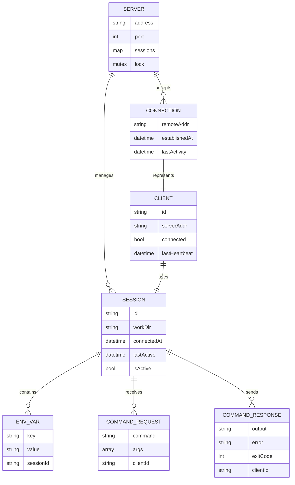
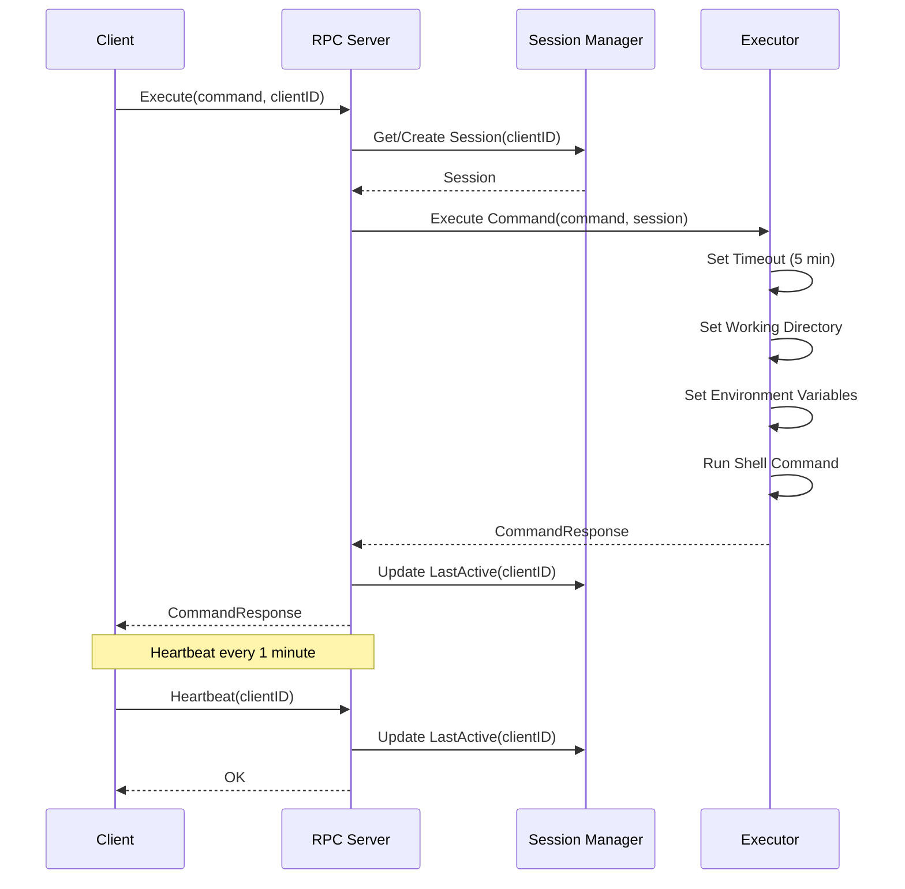
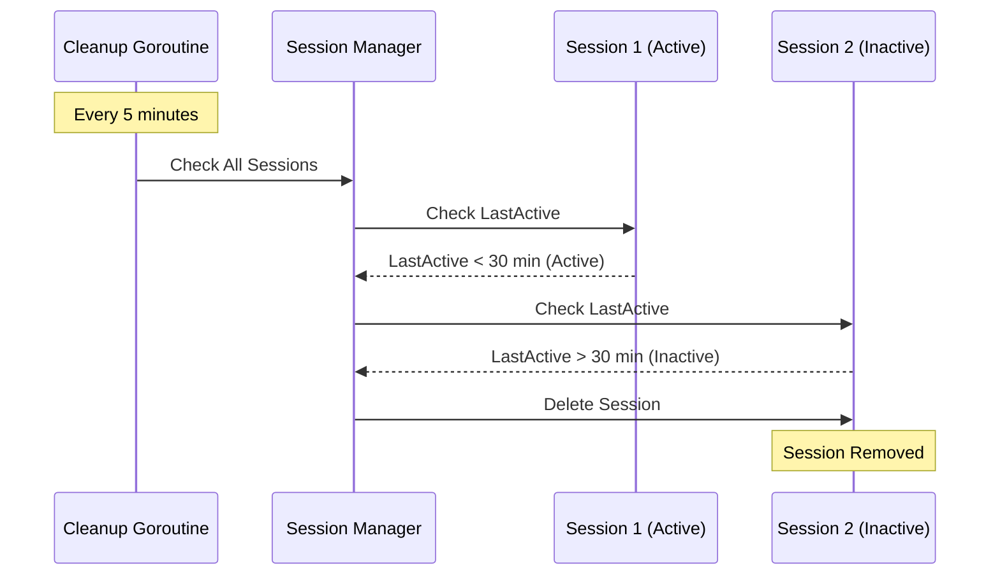
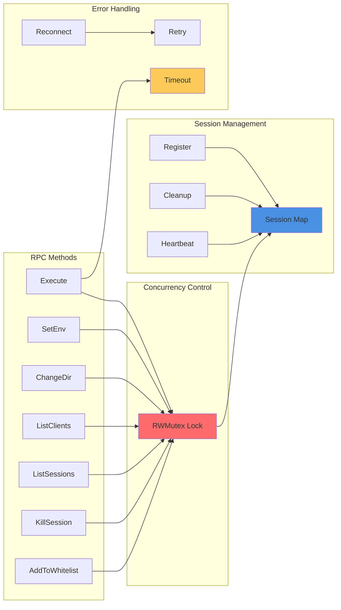
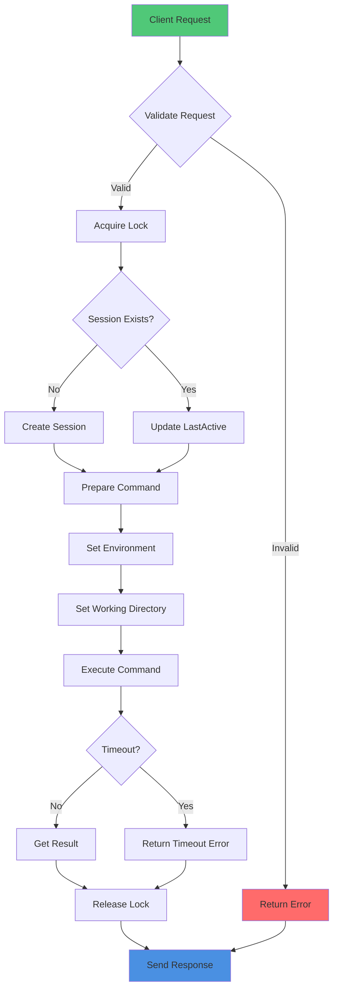

# Remote Shell RPC System - Architecture & ERM

## Entity Relationship Model (ERM)



## System Architecture Diagram

```mermaid
graph TB
    subgraph "Client Layer"
        C1[Client 1]
        C2[Client 2]
        C3[Client N]
        ADMIN[Admin Tool]
    end
    
    subgraph "Network Layer"
        TCP[TCP Connection]
        RPC[RPC Protocol]
    end
    
    subgraph "Server Layer"
        SERVER[RPC Server]
        SERVICE[RemoteShellService]
        SESSIONS[Session Manager]
        CLEANUP[Cleanup Goroutine]
    end
    
    subgraph "Session Storage"
        S1[Session 1<br/>ID, Env, WorkDir]
        S2[Session 2<br/>ID, Env, WorkDir]
        SN[Session N<br/>ID, Env, WorkDir]
    end
    
    subgraph "Execution Layer"
        EXEC[Command Executor]
        TIMEOUT[Timeout Handler]
        ENV[Environment Manager]
    end
    
    C1 -->|RPC Call| TCP
    C2 -->|RPC Call| TCP
    C3 -->|RPC Call| TCP
    ADMIN -->|Admin RPCs<br/>(list / sessions / kill / whitelist)| TCP
    
    TCP --> RPC
    RPC --> SERVER
    
    SERVER --> SERVICE
    SERVICE --> SESSIONS
    SERVICE --> EXEC
    
    SESSIONS --> S1
    SESSIONS --> S2
    SESSIONS --> SN
    
    SESSIONS --> CLEANUP
    CLEANUP -.->|Remove Inactive| S1
    CLEANUP -.->|Remove Inactive| S2
    CLEANUP -.->|Remove Inactive| SN
    
    EXEC --> TIMEOUT
    EXEC --> ENV
    ENV --> S1
    ENV --> S2
    ENV --> SN
    
    style SERVER fill:#4a90e2
    style SERVICE fill:#50c878
    style SESSIONS fill:#ff6b6b
    style EXEC fill:#feca57
```

## Sequence Diagram - Command Execution



## Sequence Diagram - Session Cleanup



## Component Interaction



## Data Flow



## Key Features

### 1. Concurrency
- **Multiple Clients**: Server handles multiple clients simultaneously using goroutines
- **Thread Safety**: Uses `sync.RWMutex` to protect shared session data
- **Non-blocking**: Each client connection runs in separate goroutine

### 2. Fault Tolerance
- **Session Cleanup**: Automatic removal of inactive sessions (30 min timeout)
- **Reconnection**: Client can reconnect if connection is lost
- **Heartbeat**: Keepalive mechanism to detect dead connections
- **Timeout Handling**: Command execution timeout (5 minutes)

### 3. Session Management
- **Isolated Sessions**: Each client has independent session
- **Environment Variables**: Per-session environment variables
- **Working Directory**: Per-session working directory
- **Activity Tracking**: Last active time tracking

### 4. Error Handling
- **Connection Errors**: Automatic reconnection on client side
- **Command Timeout**: Prevents hanging commands
- **Graceful Degradation**: Server continues operating even if one client fails

