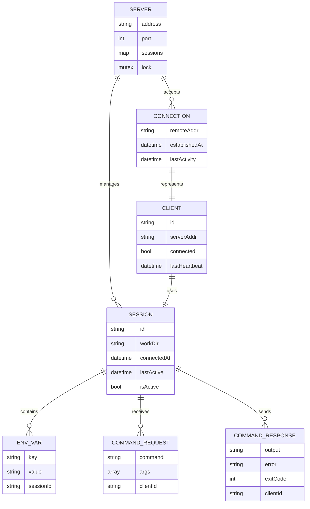
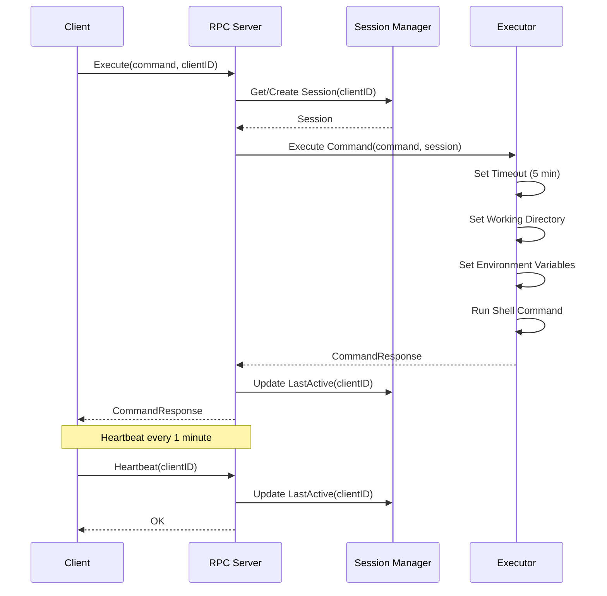

# Remote Shell RPC System - Midterm Group Project

**Course**: Distributed Systems (DS2026)  
**Student Name**: Nguyễn Duy Tân  
**Student ID**: 22BA13278  
**Group ID**: Group 14  
**Project Topic**: Remote Shell using RPC (Multiple Clients)

---

## 📋 Tổng quan dự án

Dự án **Remote Shell RPC System** là một hệ thống phân tán cho phép nhiều clients kết nối đồng thời đến một RPC server để thực thi các lệnh shell từ xa. Hệ thống mô phỏng chức năng tương tự `kubectl exec` trên Kubernetes, hỗ trợ quản lý session độc lập cho mỗi client với môi trường làm việc và biến môi trường riêng biệt.

### Mục tiêu dự án
- Xây dựng hệ thống RPC server-client để thực thi lệnh shell từ xa
- Hỗ trợ nhiều clients kết nối đồng thời
- Quản lý session độc lập cho mỗi client
- Đảm bảo các tính chất cơ bản của Distributed System

---

## 🏗️ Kiến trúc hệ thống (Architecture)

### High-Level Architecture

```
┌─────────────┐     ┌─────────────┐     ┌─────────────┐
│   Client 1  │     │   Client 2  │     │  Client N   │
│  (Session)  │     │  (Session)  │     │  (Session)  │
└──────┬──────┘     └──────┬──────┘     └──────┬──────┘
       │                   │                   │
       └───────────────────┼───────────────────┘
                           │
                    ┌──────▼──────┐
                    │  RPC Server │
                    │  (Port 8080)│
                    └──────┬──────┘
                           │
        ┌──────────────────┼──────────────────┐
        │                  │                  │
   ┌────▼────┐      ┌──────▼──────┐    ┌─────▼─────┐
   │ Session │      │  Command    │    │  Admin    │
   │ Manager │      │  Executor   │    │  Tool     │
   └─────────┘      └─────────────┘    └───────────┘
```

### Component Architecture

#### 1. **RPC Server** (`server/main.go`)
- **Chức năng**: Xử lý các RPC calls từ clients
- **Tính năng**:
  - Lắng nghe trên port 8080
  - Xử lý nhiều connections đồng thời (goroutine per connection)
  - Quản lý sessions cho mỗi client
  - Thực thi lệnh shell với timeout protection
  - Tự động cleanup sessions không hoạt động

#### 2. **RPC Client** (`client/main.go`)
- **Chức năng**: Kết nối đến server và thực thi lệnh
- **Tính năng**:
  - Interactive mode (shell tương tác)
  - Non-interactive mode (thực thi một lệnh và thoát)
  - Tự động reconnect khi mất kết nối
  - Heartbeat mechanism để giữ session alive
  - Quản lý environment variables và working directory

#### 3. **Admin Tool** (`admin/main.go`)
- **Chức năng**: Quản lý và giám sát hệ thống
- **Tính năng**:
  - Liệt kê tất cả clients đang active
  - Xem thông tin sessions

### Entity Relationship Model (ERM)



### Sequence Diagram - Command Execution Flow



---

## ✅ Tính chất của Distributed System được đảm bảo

### 1. **Concurrency (Đồng thời)**
- ✅ **Multiple Clients**: Server xử lý nhiều clients đồng thời sử dụng goroutines
- ✅ **Thread Safety**: Sử dụng `sync.RWMutex` để bảo vệ shared state (sessions map)
- ✅ **Non-blocking Operations**: Mỗi client connection chạy trong goroutine riêng biệt
- ✅ **Concurrent Command Execution**: Nhiều lệnh có thể được thực thi đồng thời bởi các clients khác nhau

**Implementation**:
```go
// Mỗi connection được xử lý trong goroutine riêng
go func(conn net.Conn) {
    rpc.ServeConn(conn)
}(conn)

// Sử dụng RWMutex để bảo vệ sessions map
r.mu.Lock()
defer r.mu.Unlock()
```

### 2. **Fault Tolerance (Chịu lỗi)**
- ✅ **Session Cleanup**: Tự động xóa sessions không hoạt động (30 phút timeout)
- ✅ **Reconnection Logic**: Client tự động reconnect khi mất kết nối
- ✅ **Heartbeat Mechanism**: Keepalive để phát hiện dead connections
- ✅ **Command Timeout**: Timeout 5 phút cho mỗi lệnh để tránh hang
- ✅ **Error Recovery**: Retry mechanism khi connection bị mất

**Implementation**:
```go
// Cleanup inactive sessions mỗi 5 phút
func (r *RemoteShellService) cleanupInactiveSessions() {
    ticker := time.NewTicker(5 * time.Minute)
    // Remove sessions inactive > 30 minutes
}

// Command timeout protection
ctx, cancel := context.WithTimeout(context.Background(), 5*time.Minute)
defer cancel()
```

### 3. **Transparency (Trong suốt)**
- ✅ **Access Transparency**: Clients truy cập remote shell như local shell
- ✅ **Location Transparency**: Clients không cần biết vị trí vật lý của server
- ✅ **Concurrency Transparency**: Nhiều clients hoạt động đồng thời mà không ảnh hưởng lẫn nhau
- ✅ **Failure Transparency**: Hệ thống tự động xử lý lỗi và recovery

### 4. **Resource Sharing (Chia sẻ tài nguyên)**
- ✅ **Shared Server**: Nhiều clients chia sẻ một RPC server
- ✅ **Isolated Sessions**: Mỗi client có session riêng với:
  - Working directory độc lập
  - Environment variables riêng
  - Command execution context riêng

### 5. **Scalability (Khả năng mở rộng)**
- ✅ **Horizontal Scaling Ready**: Architecture hỗ trợ mở rộng (có thể thêm load balancer)
- ✅ **Stateless RPC Calls**: Mỗi RPC call độc lập, dễ scale
- ✅ **Efficient Resource Usage**: Goroutines nhẹ, có thể handle nhiều clients

### 6. **Communication (Giao tiếp)**
- ✅ **RPC Protocol**: Sử dụng Go's `net/rpc` cho remote procedure calls
- ✅ **TCP/IP**: Giao thức TCP đáng tin cậy
- ✅ **Structured Messages**: Request/Response với type safety

### 7. **Consistency (Nhất quán)**
- ✅ **Session Consistency**: Mỗi client có session state nhất quán
- ✅ **Mutex Protection**: Đảm bảo thread-safe access đến shared resources

---

## 📁 Cấu trúc dự án và ý nghĩa các file

### Server Components

#### `server/main.go`
**Ý nghĩa**: File chính của RPC server, xử lý tất cả logic server-side
- Định nghĩa `RemoteShellService` struct với các RPC methods
- Quản lý sessions map với mutex protection
- Xử lý command execution với timeout
- Background goroutine để cleanup inactive sessions
- Heartbeat mechanism để track client activity

**Key Features**:
- `Execute()`: Thực thi shell command
- `Register()`: Đăng ký client session
- `SetEnv()`: Thiết lập environment variable
- `ChangeDir()`: Thay đổi working directory
- `ListClients()`: Liệt kê active clients
- `Heartbeat()`: Keepalive mechanism
- `GetSessionInfo()`: Lấy thông tin session

### Client Components

#### `client/main.go`
**Ý nghĩa**: File chính của RPC client, cung cấp interface để tương tác với server
- Kết nối đến RPC server
- Interactive và non-interactive modes
- Tự động reconnect khi mất kết nối
- Heartbeat goroutine để giữ session alive
- Xử lý các lệnh đặc biệt (cd, setenv, exit, help)

**Key Features**:
- `NewRemoteShellClient()`: Tạo client connection
- `Execute()`: Gửi command đến server với retry logic
- `Reconnect()`: Tự động reconnect
- `SendHeartbeat()`: Gửi heartbeat để keep session alive
- `SetEnv()`, `ChangeDir()`, `Register()`: Quản lý session

### Admin Components

#### `admin/main.go`
**Ý nghĩa**: Tool quản trị để giám sát hệ thống
- Kết nối đến server và liệt kê tất cả active clients
- Hiển thị số lượng clients đang kết nối
- Hữu ích cho monitoring và debugging

### Build & Run Scripts

#### `build.ps1` / `build.bat`
**Ý nghĩa**: Scripts để build tất cả components (server, client, admin)
- Tự động compile Go code thành executables
- Tạo thư mục `bin/` nếu chưa có
- Build cho Windows (PowerShell và Batch)

#### `run-server.ps1`
**Ý nghĩa**: Script để chạy server
- Tự động build nếu cần
- Chạy server trên port 8080
- Hiển thị thông tin kết nối

#### `run-client.ps1`
**Ý nghĩa**: Script để chạy client
- Tự động build nếu cần
- Kết nối đến server
- Hỗ trợ interactive mode

#### `check-ip.ps1`
**Ý nghĩa**: Script để kiểm tra IP addresses
- Liệt kê tất cả IP addresses của máy
- Hữu ích để tìm server IP cho remote connections

### Configuration Files

#### `go.mod`
**Ý nghĩa**: Go module file định nghĩa dependencies
- Module name: `remote-shell-rpc`
- Go version: 1.21+
- Quản lý dependencies (hiện tại chỉ dùng standard library)

#### `Makefile`
**Ý nghĩa**: Makefile cho build automation
- Các targets: `build`, `run-server`, `run-client`, `clean`
- Hỗ trợ cross-platform builds
- Tương thích với Linux/Mac

---

## 🚀 Hướng dẫn sử dụng

### Yêu cầu hệ thống
- Go 1.21 hoặc cao hơn
- Windows/Linux/Mac OS

### Build dự án

**Windows (PowerShell)**:
```powershell
.\build.ps1
```

**Linux/Mac**:
```bash
make build
```

### Chạy Server

**Windows**:
```powershell
.\run-server.ps1
```

**Linux/Mac**:
```bash
make run-server
# hoặc
./bin/server
```

Server sẽ chạy trên port `8080` và hiển thị IP addresses để clients kết nối.

### Chạy Client

**Windows**:
```powershell
.\run-client.ps1 -ClientID my-client-1
```

**Linux/Mac**:
```bash
./bin/client -id my-client-1
```

### Chạy Admin Tool

```powershell
.\bin\admin.exe
```

---

## 📊 So sánh với kubectl exec

| Tính năng | kubectl exec | Remote Shell RPC |
|-----------|--------------|------------------|
| Remote execution | ✅ | ✅ |
| Multiple clients | ✅ (multiple pods) | ✅ |
| Session management | ✅ (per pod) | ✅ (per client ID) |
| Environment vars | ✅ | ✅ |
| Working directory | ✅ | ✅ |
| Streaming output | ✅ | ⚠️ (batch) |
| Interactive TTY | ✅ | ⚠️ (basic) |
| Authentication | ✅ | ❌ (chưa có) |
| TLS/SSL | ✅ | ❌ (chưa có) |

---

## 🔧 Các cải tiến đã thực hiện

### 1. **Session Management**
- ✅ Tự động cleanup sessions không hoạt động (30 phút)
- ✅ Tracking last active time
- ✅ Isolated environment per session

### 2. **Fault Tolerance**
- ✅ Command execution timeout (5 phút)
- ✅ Client reconnection logic
- ✅ Heartbeat mechanism
- ✅ Error handling và recovery

### 3. **Concurrency**
- ✅ Goroutine per connection
- ✅ RWMutex cho thread-safe access
- ✅ Non-blocking operations

### 4. **Error Handling**
- ✅ Connection timeout
- ✅ Retry mechanism
- ✅ Graceful error messages

---

## 🔮 Hướng phát triển tương lai

- [ ] **Security**: Authentication và authorization
- [ ] **Encryption**: TLS/SSL support
- [ ] **Streaming**: Real-time output streaming
- [ ] **Interactive TTY**: Full TTY support
- [ ] **Load Balancing**: Multiple server instances
- [ ] **Monitoring**: Metrics và logging nâng cao
- [ ] **File Transfer**: SCP-like file transfer
- [ ] **gRPC**: Migration từ net/rpc sang gRPC
- [ ] **Docker Support**: Containerization
- [ ] **Kubernetes Integration**: Native k8s support

---

## 📝 Kết luận

Dự án **Remote Shell RPC System** đã thành công trong việc:
- ✅ Xây dựng hệ thống RPC server-client hoàn chỉnh
- ✅ Hỗ trợ multiple clients đồng thời
- ✅ Đảm bảo các tính chất cơ bản của Distributed System:
  - Concurrency
  - Fault Tolerance
  - Transparency
  - Resource Sharing
  - Scalability
  - Communication
  - Consistency

Hệ thống có thể được sử dụng như một công cụ quản lý remote shell execution, tương tự kubectl exec, với khả năng mở rộng và cải tiến trong tương lai.

---

## 📚 Tài liệu tham khảo

- Go RPC Documentation: https://pkg.go.dev/net/rpc
- Distributed Systems Concepts: Tanenbaum & Van Steen
- Kubernetes kubectl exec: https://kubernetes.io/docs/reference/generated/kubectl/kubectl-commands#exec

---

**Last Updated**: December 2025  
**Version**: 1.0.0

