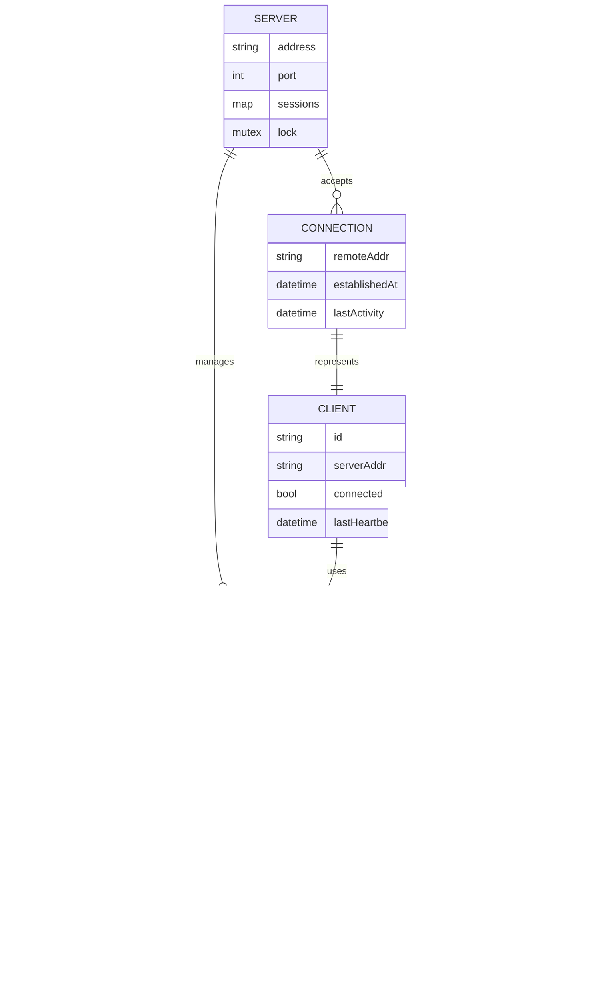
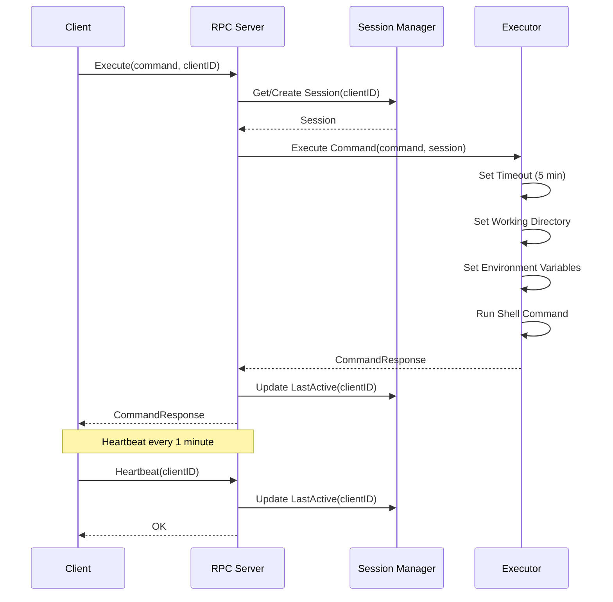

# Remote Shell RPC System - Midterm Group Project

**Course**: Distributed Systems (DS2026)  
**Student Name**: Nguyễn Duy Tân  
**Student ID**: 22BA13278  
**Group ID**: Group 14  
**Project Topic**: Remote Shell using RPC (Multiple Clients)

---

## Tổng quan dự án

Dự án **Remote Shell RPC System** là một hệ thống phân tán cho phép nhiều clients kết nối đồng thời đến một RPC server để thực thi các lệnh shell từ xa. Hệ thống mô phỏng chức năng tương tự `kubectl exec` trên Kubernetes, hỗ trợ quản lý session độc lập cho mỗi client với môi trường làm việc và biến môi trường riêng biệt.

### Mục tiêu dự án
- Xây dựng hệ thống RPC server-client để thực thi lệnh shell từ xa
- Hỗ trợ nhiều clients kết nối đồng thời
- Quản lý session độc lập cho mỗi client
- Đảm bảo các tính chất cơ bản của Distributed System

---

## Kiến trúc hệ thống

### Kiến trúc tổng quan

```
┌─────────────┐     ┌─────────────┐     ┌─────────────┐
│   Client 1  │     │   Client 2  │     │  Client N   │
│  (Session)  │     │  (Session)  │     │  (Session)  │
└──────┬──────┘     └──────┬──────┘     └──────┬──────┘
       │                   │                   │
       └───────────────────┼───────────────────┘
                           │
                    ┌──────▼──────┐
                    │  RPC Server │
                    │  (Port 8080)│
                    └──────┬──────┘
                           │
        ┌──────────────────┼──────────────────┐
        │                  │                  │
   ┌────▼────┐      ┌──────▼──────┐    ┌─────▼─────┐
   │ Session │      │  Command    │    │  Admin    │
   │ Manager │      │  Executor   │    │  Tool     │
   └─────────┘      └─────────────┘    └───────────┘
```

### Kiến trúc thành phần

#### 1. **RPC Server** (`server/main.go`)
- Goroutine per connection, quản lý session
- Timeout lệnh, giới hạn runtime và kích thước output
- Whitelist lệnh, chặn chaining/piping (`|`, `&&`, `||`, `;`)
- Rate limit theo client, session timeout + cleanup
- Auth token cho tất cả RPC (tùy chọn), TLS tùy chọn

#### 2. **RPC Client** (`client/main.go`)
- Interactive / one-shot command
- Tự động reconnect, heartbeat keepalive
- Gửi auth token, set env, change dir

#### 3. **Admin Tool** (`admin/main.go`)
- Liệt kê clients đang active (có thể kèm token)
- Lệnh quản trị:
  - `-sessions` : xem chi tiết session (id, workdir, env_count, last_active, idle)
  - `-kill <id>`: kill session theo client ID

### Bảo mật & kiểm soát
- Auth token cho mọi RPC (bật qua `--auth-token`)
- TLS tùy chọn (`--tls-cert`, `--tls-key`)
- Whitelist lệnh; chặn chaining/piping
- Rate limit per client; session timeout + cleanup
- Giới hạn runtime lệnh và kích thước output
- Admin có thể liệt kê/kết thúc session; kill sẽ “ban” client ID (các RPC sau bị từ chối)

### Entity Relationship Model (ERM)



### Sequence Diagram - Command Execution Flow



---

## Tính chất của Distributed System được đảm bảo

### 1. **Concurrency (Đồng thời)**
- **Nhiều Clients**: Server xử lý nhiều clients đồng thời sử dụng goroutines
- **An toàn luồng**: Sử dụng `sync.RWMutex` để bảo vệ shared state (sessions map)
- **Thao tác không chặn**: Mỗi client connection chạy trong goroutine riêng biệt
- **Thực thi lệnh đồng thời**: Nhiều lệnh có thể được thực thi đồng thời bởi các clients khác nhau

**Implementation**:
```go
// Mỗi connection được xử lý trong goroutine riêng
go func(conn net.Conn) {
    rpc.ServeConn(conn)
}(conn)

// Sử dụng RWMutex để bảo vệ sessions map
r.mu.Lock()
defer r.mu.Unlock()
```

### 2. **Fault Tolerance (Chịu lỗi)**
- Dọn dẹp session không hoạt động (timeout)
- Client reconnect + heartbeat
- Timeout lệnh, giới hạn runtime/output
- Rate limit để giảm overload

### 3. **Security & Access Control**
- Auth token (tùy chọn), TLS (tùy chọn)
- Whitelist lệnh, chặn chaining/piping
- Session isolation (workdir, env riêng)

### 4. **Resource Sharing (Chia sẻ tài nguyên)**
- **Server chia sẻ**: Nhiều clients chia sẻ một RPC server
- **Sessions cô lập**: Mỗi client có session riêng với:
  - Working directory độc lập
  - Environment variables riêng
  - Command execution context riêng

### 5. **Scalability (Khả năng mở rộng)**
- Sẵn sàng mở rộng ngang (có thể đặt sau load balancer)
- RPC không trạng thái (dễ scale)
- Goroutines nhẹ, handle nhiều clients

### 6. **Communication (Giao tiếp)**
- **Giao thức RPC**: Sử dụng Go's `net/rpc` cho remote procedure calls
- **TCP/IP**: Giao thức TCP đáng tin cậy
- **Tin nhắn có cấu trúc**: Request/Response với type safety

### 7. **Consistency (Nhất quán)**
- **Nhất quán Session**: Mỗi client có session state nhất quán
- **Bảo vệ Mutex**: Đảm bảo thread-safe access đến shared resources

---

## Cấu trúc dự án và ý nghĩa các file

### Server Components

#### `server/main.go`
**Ý nghĩa**: File chính của RPC server, xử lý tất cả logic server-side
- Định nghĩa `RemoteShellService` struct với các RPC methods
- Quản lý sessions map với mutex protection
- Xử lý command execution với timeout
- Background goroutine để cleanup inactive sessions
- Heartbeat mechanism để track client activity

**Tính năng chính**:
- `Execute()`: Thực thi shell command
- `Register()`: Đăng ký client session
- `SetEnv()`: Thiết lập environment variable
- `ChangeDir()`: Thay đổi working directory
- `ListClients()`: Liệt kê active clients
- `Heartbeat()`: Keepalive mechanism
- `GetSessionInfo()`: Lấy thông tin session

### Client Components

#### `client/main.go`
**Ý nghĩa**: File chính của RPC client, cung cấp interface để tương tác với server
- Kết nối đến RPC server
- Interactive và non-interactive modes
- Tự động reconnect khi mất kết nối
- Heartbeat goroutine để giữ session alive
- Xử lý các lệnh đặc biệt (cd, setenv, exit, help)

**Tính năng chính**:
- `NewRemoteShellClient()`: Tạo client connection
- `Execute()`: Gửi command đến server với retry logic
- `Reconnect()`: Tự động reconnect
- `SendHeartbeat()`: Gửi heartbeat để keep session alive
- `SetEnv()`, `ChangeDir()`, `Register()`: Quản lý session

### Admin Components

#### `admin/main.go`
**Ý nghĩa**: Tool quản trị để giám sát hệ thống
- Kết nối đến server và liệt kê tất cả active clients
- Hiển thị số lượng clients đang kết nối
- Hữu ích cho monitoring và debugging

### Scripts Build và Chạy

#### `build.ps1` / `build.bat`
**Ý nghĩa**: Scripts để build tất cả components (server, client, admin)
- Tự động compile Go code thành executables
- Tạo thư mục `bin/` nếu chưa có
- Build cho Windows (PowerShell và Batch)

#### `run-server.ps1`
**Ý nghĩa**: Script để chạy server
- Tự động build nếu cần
- Chạy server trên port 8080
- Hiển thị thông tin kết nối

#### `run-client.ps1`
**Ý nghĩa**: Script để chạy client
- Tự động build nếu cần
- Kết nối đến server
- Hỗ trợ interactive mode

#### `check-ip.ps1`
**Ý nghĩa**: Script để kiểm tra IP addresses
- Liệt kê tất cả IP addresses của máy
- Hữu ích để tìm server IP cho remote connections

### File Cấu hình

#### `go.mod`
**Ý nghĩa**: Go module file định nghĩa dependencies
- Module name: `remote-shell-rpc`
- Go version: 1.21+
- Quản lý dependencies (hiện tại chỉ dùng standard library)

#### `Makefile`
**Ý nghĩa**: Makefile cho build automation
- Các targets: `build`, `run-server`, `run-client`, `clean`
- Hỗ trợ cross-platform builds
- Tương thích với Linux/Mac

---

## Hướng dẫn sử dụng

### Yêu cầu hệ thống
- Go 1.21 hoặc cao hơn
- Windows / Linux / macOS

#### Cài Go nhanh
- **Ubuntu/Debian**:
```bash
sudo apt update
sudo apt install golang-go
go version
```
- **Windows/macOS**: tải installer từ `https://go.dev/dl/`, cài đặt rồi kiểm tra:
```bash
go version
```

### Build dự án

**Windows (PowerShell)**:
```powershell
.\build.ps1
```

**Linux/Mac**:
```bash
make build
```

### Chạy Server (Windows/Linux/Mac)
- Bật token + whitelist + rate limit (không TLS):
```bash
./bin/server --auth-token mytoken --allow-commands "dir,echo" --rate-limit 60 --rate-window-sec 60
# Windows PowerShell: .\bin\server.exe --auth-token mytoken --allow-commands "dir,echo" --rate-limit 60 --rate-window-sec 60
```
- Bật TLS (tùy chọn, sau khi có `cert.pem`, `key.pem`):
```bash
./bin/server --auth-token mytoken --tls-cert cert.pem --tls-key key.pem
```
Port mặc định 8080, đổi bằng `--port`.

### Tạo TLS cert self-signed nhanh (Go đã cài sẵn)
```powershell
$goroot = go env GOROOT
go run "$goroot\src\crypto\tls\generate_cert.go" -host "localhost"
# sinh ra cert.pem, key.pem
```
(Hoặc dùng openssl/mkcert nếu đã cài).

### Chạy Client (có token)
```bash
./bin/client -server localhost:8080 -id client1 -token mytoken
# Windows: .\bin\client.exe -server localhost:8080 -id client1 -token mytoken
```
Nếu server bật TLS nhưng client chưa hỗ trợ TLS dial: chạy server không TLS để client/admin kết nối; (muốn TLS cần sửa client sử dụng tls.Dial).

### Chạy Admin Tool (quản trị)
- **List clients**:
  ```bash
  ./bin/admin -server localhost:8080 -token mytoken
  ```
- **List sessions chi tiết**:
  ```bash
  ./bin/admin -server localhost:8080 -token mytoken -sessions
  ```
- **Kill + ban session theo client ID**:
  ```bash
  ./bin/admin -server localhost:8080 -token mytoken -kill client1
  ```
  Sau khi kill/ban, client ID đó sẽ bị từ chối ở mọi RPC tiếp theo (Execute, Heartbeat, Register,...).
- **Thêm command vào whitelist khi server đang chạy**:
  ```bash
  ./bin/admin -server localhost:8080 -token mytoken -allow-cmds "ls,cat,tail"
  ```
  Lệnh này merge thêm `ls`, `cat`, `tail` vào whitelist hiện tại (lấy theo từ đầu tiên của command).

---

## So sánh với kubectl exec

| Tính năng | kubectl exec | Remote Shell RPC |
|-----------|--------------|------------------|
| Thực thi từ xa | Có | Có |
| Nhiều clients | Có (multiple pods) | Có |
| Quản lý session | Có (per pod) | Có (per client ID) |
| Biến môi trường | Có | Có |
| Thư mục làm việc | Có | Có |
| Streaming output | Có | Hạn chế (batch) |
| Interactive TTY | Có | Hạn chế (basic) |
| Xác thực | Có | Có (token) |
| TLS/SSL | Có | Có (tùy chọn) |

---

## Các cải tiến đã thực hiện

### 1. **Quản lý Session**
- Tự động cleanup sessions không hoạt động (30 phút)
- Theo dõi thời gian hoạt động cuối cùng
- Môi trường cô lập cho mỗi session

### 2. **Chịu lỗi**
- Timeout thực thi lệnh (5 phút)
- Logic kết nối lại của client
- Cơ chế Heartbeat
- Xử lý lỗi và khôi phục

### 3. **Đồng thời**
- Goroutine cho mỗi kết nối
- RWMutex cho truy cập an toàn luồng
- Thao tác không chặn

### 4. **Xử lý lỗi**
- Timeout kết nối
- Cơ chế thử lại
- Thông báo lỗi rõ ràng

---

## Hướng phát triển tương lai

- [ ] **Bảo mật**: Xác thực và phân quyền
- [ ] **Mã hóa**: Hỗ trợ TLS/SSL
- [ ] **Streaming**: Streaming output thời gian thực
- [ ] **Interactive TTY**: Hỗ trợ TTY đầy đủ
- [ ] **Cân bằng tải**: Nhiều instance server
- [ ] **Giám sát**: Metrics và logging nâng cao
- [ ] **Truyền file**: Truyền file kiểu SCP
- [ ] **gRPC**: Chuyển đổi từ net/rpc sang gRPC
- [ ] **Hỗ trợ Docker**: Containerization
- [ ] **Tích hợp Kubernetes**: Hỗ trợ k8s native

---

## Kết luận

Dự án **Remote Shell RPC System** đã thành công trong việc:
- Xây dựng hệ thống RPC server-client hoàn chỉnh
- Hỗ trợ nhiều clients đồng thời
- Đảm bảo các tính chất cơ bản của Distributed System:
  - Concurrency (Đồng thời)
  - Fault Tolerance (Chịu lỗi)
  - Transparency (Trong suốt)
  - Resource Sharing (Chia sẻ tài nguyên)
  - Scalability (Khả năng mở rộng)
  - Communication (Giao tiếp)
  - Consistency (Nhất quán)

Hệ thống có thể được sử dụng như một công cụ quản lý remote shell execution, tương tự kubectl exec, với khả năng mở rộng và cải tiến trong tương lai.

---

## Tài liệu tham khảo

- Go RPC Documentation: https://pkg.go.dev/net/rpc
- Distributed Systems Concepts: Tanenbaum & Van Steen
- Kubernetes kubectl exec: https://kubernetes.io/docs/reference/generated/kubectl/kubectl-commands#exec

---

**Cập nhật lần cuối**: Tháng 12 năm 2025

